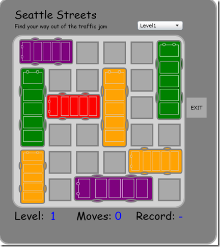

# Seattle Streets

This is a puzzle game (also known as grid locked, or rush hour) - originally created in Silverlight for a lab series for [my blog](http://tessferrandez.github.io) - While restoring my blog in 2020 I updated this to the closest available technology (WPF) and moved the lab series to this repo instead.

I have left the instructions completely as is (with Silverlight references) but everything except for isolated storage is almost identical in WPF

1. [Create the main Layout](docs/lab1-create-main-layout.md)
2. [Create a car user control](docs/lab2-create-a-car-user-control.md)
3. [Use Linq to XML to read and generate levels](docs/lab3-use-linq-to-xml-to-read-and-generate-levels.md)
4. [Add drag and drop functionality to move cars around](docs/lab4-add-drag-and-drop-functionality-to-move-cars-around.md)
5. [Store high scores in Isolated Storage with Linq to XML](docs/lab5-store-highscores-in-isolated-storage.md)

The resulting game is a fully playable game with 10 levels
