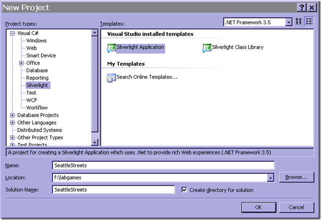

# Create the Main Layout

## 1. Create a new Silverlight Application using VS 2008 and call it SeattleStreets



When you click ok you will be asked to create an asp.net application or automatically generate a test page to host Silverlight at build time.  We can choose the latter for this project.

When we create the project, we get App.XAML + App.XAML.cs which is the starting point for our application.  This generates an instance of our only user control (Page.XAML/Page.XAML.cs) and provides some basic error handling for unhandled exceptions.

There are two ways to create the visual aspects of the application, either declaratively in the XAML, or programmatically from the cs file.
We will use a combination of both for this project.

By default the Page usercontrol will be 400x300px and use a Grid as it’s root element.  There are a couple of different LayoutTypes to choose from, such as

- **Grid** – Arranges items in a table style manner, good if you want to create a UI that can resize itself based on the host size or the contents.
- **Canvas** – Used for exact positioning
- **StackPanel** – Stacks the contained items one after another either vertically or horizontally
We will be using a 5x4 Grid as our root element to position the layout elements.


## 2. Change the Height to 540 and Width to 480 on the Page

## 3. Add 5 columns and 3 rows to the grid

```xml
<Grid.ColumnDefinitions>
    <ColumnDefinition Width="30"/>
    <ColumnDefinition/>
    <ColumnDefinition/>
    <ColumnDefinition/>
    <ColumnDefinition Width="70"/>
</Grid.ColumnDefinitions>
<Grid.RowDefinitions>
    <RowDefinition/>
    <RowDefinition Height="380"/>
    <RowDefinition/>
</Grid.RowDefinitions>
```

You can make the widths of the columns and the heights of the columns relative to each other by setting the height to * and 4* for example, which would mean that the 2nd column is 4 times the size of the first one.

In the case above, the total width of the page is 480, the outer columns take up 30+70px which means that the center columns split the other 380px evenly.

The order in which we add items in the XAML is important as that defines the z-order (i.e. whether an item is in front of another or not)

## 4. Add the page background and the center background to the Grid

For this we use two borders (so we can get the rounded corners).  As they have no height and width they will fill out the space of the grid cells.

```cmd
<Border Background="Gray" BorderBrush="DarkGray" BorderThickness="3.0" CornerRadius="20" Grid.Row="0" Grid.Column="0" Grid.RowSpan="3" Grid.ColumnSpan="5"/>
<Border Background="LightGray" BorderBrush="DarkGray" BorderThickness="3.0" CornerRadius="20" Grid.Row="1" Grid.Column="1" Grid.ColumnSpan="3"/>
```

## 5. Add the Level/Moves/Record text blocks to the Grid

You can either add TextBlock items with a specific Text or use TextBlocks with `<Run>` tags so that you can update only parts of the text block. In this case we add 3 text blocks with 2 run tags each,  one for the static content and one for the dynamic content

```xml
<TextBlock FontFamily="Comic Sans MS" FontSize="24" Grid.Row="2" Grid.Column="1" Margin="5,0,0,0">
    <Run Text="Level: " />
    <Run x:Name="tbLevel" Text="1" Foreground="Blue" />
</TextBlock>
<TextBlock FontFamily="Comic Sans MS" FontSize="24" TextAlignment="Center" Grid.Row="2" Grid.Column="2">
    <Run Text="Moves:"/>
    <Run x:Name="tbMoves" Text="0" Foreground="Blue"/>
</TextBlock>
<TextBlock FontFamily="Comic Sans MS" FontSize="24" TextAlignment="Right" Grid.Row="2" Grid.Column="3" Margin="0,0,5,0" >
    <Run Text="Record:"/>
    <Run x:Name="tbBest" Text="-" Foreground="Blue"/>
</TextBlock>
```

By giving them an x:Name we can later refer to them in the code-behind

The Margin (left, top, right, bottom) allows us to do some spacing around the text blocks and the TextAlignment is used to position the elements in their respective grid cells.

## 6. Add the “LOGO” Text block

Ideally we should have probably had a logo here, but I will leave it as an exercise for you to draw a logo:) To make it easy for myself I just added a text block with two separate run items so that i could divide them with a line break and give them different font sizes.

```xml
<TextBlock Grid.Row="0" Grid.Column="1" Grid.ColumnSpan="2" VerticalAlignment="Bottom" Margin="5,0,0,10">
    <Run Text="Seattle Streets" FontFamily="Comic Sans MS" FontSize="24" />
    <LineBreak/>
    <Run Text="Find your way out of the traffic jam" FontFamily="Comic Sans MS" FontSize="12"/>
</TextBlock>
```

It will span two cells and `VerticalAlignment=bottom` means that it will be placed at the bottom of the cells. The margin positions it 5 pixels in and 10 pixels up.

## 7. Add the level ComboBox

There is nothing really special about this combobox. The VerticalAlignment and Margin are set in a similar fashion as the Logo, and I have set the width to 100px to avoid that it spans the whole cell. The HorizontalAlignment pushes it to the right of the cell.

```xml
<ComboBox x:Name="cboLevel" Grid.Row="0" Grid.Column="3" VerticalAlignment="Bottom" Margin="0,0,5,10" Width="100" HorizontalAlignment="Right">
    <ComboBoxItem Content="Level1" IsSelected="True"/>
    <ComboBoxItem Content="Level2" />
    <ComboBoxItem Content="Level3" />
    … through Level 10
</ComboBox>
```

## 8. Add the background street grid pattern

The background grid is not visible in the page layout because the elements are added at runtime.  We could have added it at design time but I did it this way to avoid cluttering up the XAML too much…


First we add the actual Grid in the XAML

```xml
<Grid x:Name="grid" Height="360" Width="420" Grid.Row="1" Grid.Column="1" Grid.ColumnSpan="4" ShowGridLines="True"/>
```

Then we can add the following code to the Page class to create the ColumnDefinitions and RowDefinitions for our 6x7 grid as well as adding the little boxes that make up the visual appearance of the grid, and the EXIT text on the exit slot.

```csharp
const int GridSize = 6;
const int SquareSize = 50;

SolidColorBrush white = new SolidColorBrush(Colors.White);
SolidColorBrush gray = new SolidColorBrush(Colors.Gray);
SolidColorBrush darkGray = new SolidColorBrush(Colors.DarkGray);
private void AddSquares()
{
    for (int i = 0; i < GridSize; i++)
    {
        RowDefinition rd = new RowDefinition();
        grid.RowDefinitions.Add(rd);
        ColumnDefinition cd = new ColumnDefinition();
        grid.ColumnDefinitions.Add(cd);
    }
    ColumnDefinition cdExit = new ColumnDefinition();
    grid.ColumnDefinitions.Add(cdExit);

    for (int i = 0; i < GridSize; i++)
    {
        for (int j = 0; j < GridSize; j++)
        {
            AddSquare(i, j);
        }
    }

    //Exit box
    AddSquare(2, 6);

    TextBlock tb = new TextBlock();
    tb.Text = "EXIT";
    tb.HorizontalAlignment = HorizontalAlignment.Center;
    tb.VerticalAlignment = VerticalAlignment.Center;
    grid.Children.Add(tb);
    tb.SetValue(Grid.RowProperty, 2);
    tb.SetValue(Grid.ColumnProperty, 6);
}

void AddSquare(int row, int col)
{
    Border brd = new Border();
    brd.Background = darkGray;
    brd.BorderBrush = gray;
    brd.BorderThickness = new Thickness(3.0);
    brd.Margin = new Thickness(2.0);
    brd.Height = SquareSize;
    brd.Width = SquareSize;
    grid.Children.Add(brd);
    brd.SetValue(Grid.RowProperty, row);
    brd.SetValue(Grid.ColumnProperty, col);
}
```

Finally we call AddSquares() in the page constructor after the InitializeComponent call. The InitializeComponent call will build up the page based on the contents of the XAML file so it is important that this is done before our call since we need access to the grid object.

## 9. Add the canvas that the cars will move on

The last piece of the main layout is the canvas that the cars will be placed on.  It will be placed on top of the grid we created in the previous step so that it appears as if the cars moved on top of the street grid

```xml
<Canvas x:Name="CarCanvas" Height="360" Width="420" Grid.Row="1" Grid.Column="1" Grid.ColumnSpan="4"/>
```

In part 2 we will go through creating and displaying a separate user control for the car objects.