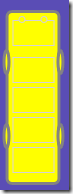
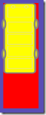
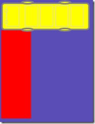
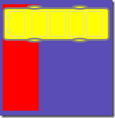

# Create a Car UserControl

In [Part 1](lab1-create-main-layout.md) we created the layout for the page/playing board, in this post we will create a Car UserControl to place on the board.



The car we are creating will look something like this.  It’s really just a couple of rectangles and ellipses but using Expression Blend or Expression Design you can edit it to have a more appealing design if you are so inclined.

The car has 5 properties:

| Property | Type | Description |
| -- | -- | -- |
| Orientation | System.Windows.Controls.Orientation | Is the car horizontal or vertical |
| Length | int | Car length, can be 2 squares (120px) or 3 squares (180 px) |
| Color | System.Windows.Media.Color | Color of the car |
| Row | int | Starting row |
| Column | int | Starting column |

## 1. Create a new usercontrol

Right-click on the solution and choose Add New Item, in the Add New Item dialog, choose Silverlight User Control, name it Car and click Add.

## 2. Add the graphics

Remove the height and the width properties of the UserControl and add the visual elements to the XAML in the LayoutRoot grid. The size of the graphics should be approximately 175px in height and 55px in width to allow for some spacing between the cars.

You can either choose to just add a rectangle, or open the UserControl in Expression Blend and make it more “car like”.

The graphical elements for the car above are listed below:

```xml
<Rectangle Height="175" HorizontalAlignment="Left" Margin="0.25,0,0,0" VerticalAlignment="Top" Width="55" Fill="#FFFFFF00" Stroke="#FF808080" StrokeThickness="3" RadiusX="5" RadiusY="5" x:Name="p1"/>
<Rectangle Height="26" HorizontalAlignment="Left" Margin="7,10,0,0" VerticalAlignment="Top" Width="42.25" Fill="#FFFFFF00" Stroke="#FFD3D3D3" StrokeThickness="1" RadiusX="0" RadiusY="0" x:Name="p2"/>
<Ellipse Height="7.25" HorizontalAlignment="Left" Margin="13,6,0,0" VerticalAlignment="Top" Width="7.25" Fill="#FFFFFF00" Stroke="#FFD3D3D3" StrokeThickness="1" x:Name="p3"/>
<Ellipse Height="7.25" HorizontalAlignment="Left" Margin="35,6,0,0" VerticalAlignment="Top" Width="7.25" Fill="#FFFFFF00" Stroke="#FFD3D3D3" StrokeThickness="1" x:Name="p4"/>
<Rectangle Height="26" HorizontalAlignment="Left" Margin="7,47,0,0" VerticalAlignment="Top" Width="42.25" Fill="#FFFFFF00" Stroke="#FFD3D3D3" StrokeThickness="1" RadiusX="0" RadiusY="0" x:Name="p5"/>
<Rectangle Height="26" HorizontalAlignment="Left" Margin="7,77,0,0" VerticalAlignment="Top" Width="42.25" Fill="#FFFFFF00" Stroke="#FFD3D3D3" StrokeThickness="1" RadiusX="0" RadiusY="0" x:Name="p6"/>
<Rectangle Height="26" HorizontalAlignment="Left" Margin="7,107,0,0" VerticalAlignment="Top" Width="42.25" Fill="#FFFFFF00" Stroke="#FFD3D3D3" StrokeThickness="1" RadiusX="0" RadiusY="0" x:Name="p7"/>
<Rectangle HorizontalAlignment="Left" Margin="7,137,0,0" Width="42.25" Fill="#FFFFFF00" Stroke="#FFD3D3D3" StrokeThickness="1" RadiusX="0" RadiusY="0" Height="26" VerticalAlignment="Top" x:Name="p8"/>
<Ellipse Height="25.5" HorizontalAlignment="Left" Margin="51,39,0,0" VerticalAlignment="Top" Width="7.5" Fill="#FFFFFF00" Stroke="#FF808080" StrokeThickness="3" x:Name="p9"/>
<Ellipse Height="25.5" HorizontalAlignment="Left" Margin="51,113,0,0" VerticalAlignment="Top" Width="7.5" Fill="#FFFFFF00" Stroke="#FF808080" StrokeThickness="3" x:Name="p10"/>
<Ellipse Height="25.5" HorizontalAlignment="Left" Margin="-2.75,39,0,0" VerticalAlignment="Top" Width="7.5" Fill="#FFFFFF00" Stroke="#FF808080" StrokeThickness="3" x:Name="p11"/>
<Ellipse Height="25.5" HorizontalAlignment="Left" Margin="-2.75,113,0,0" VerticalAlignment="Top" Width="7.5" Fill="#FFFFFF00" Stroke="#FF808080" StrokeThickness="3" x:Name="p12"/>
```

> Note that I have added x:Names to all the element so that we can refer to them in code and change the color (Fill) of the elements based on the Color property of the Car.

## 3. Add transformations to allow for different lengths and orientations

You can temporarily enclose this grid in another grid with the background set to red so that you can see the effect of the transformations compared to the original layout.

We will add three transformations to the grid  (note again that they are named so that we can refer to them in code)

```xml
<Grid.RenderTransform>
    <TransformGroup>
        <ScaleTransform x:Name="scaleCar" ScaleY="1"/>
        <RotateTransform x:Name="rotateCar" Angle="0" />
        <TranslateTransform x:Name="translateCar" Y="0"/>
    </TransformGroup>
</Grid.RenderTransform>
```

| Property | Transformation | Result |
| -- | -- | -- |
| Length = 2 | scaleCar.ScaleY = 0.67 |  |
| Orientation = Horizontal | rotateCar.Angle = –90 |  |
|  | translateCar.Y = 60 |  |

## 3. Placing the car on the Page canvas declaratively

Build your application to compile the Car user control.

Return to the Page.xaml and add the following to the usercontrol declaration

```xml
xmlns:custom="clr-namespace:SeattleStreets"
```

Now we can create cars declaratively in the XAML using `<custom:Car…/>`

Add a car to the CarCanvas

```xml
<Canvas x:Name="CarCanvas" Height="360" Width="420" Grid.Row="1" Grid.Column="1" Grid.ColumnSpan="4">
    <custom:Car/>
</Canvas>
```

That is all well and good, but in our case we will be adding them programmatically to build up the different levels, so we can remove this again for now.

## 4. Add the code for the car

The code for the car is very simple. We will not have any parameter less constructors, which will cause a problem if we want to create the car declaratively, but as we are not doing that, we don’t have to worry about it.

Creating a control (for example the canvas above) declaratively is pretty much the same as using the default constructor and using Initializers.

```csharp
Canvas CarCanvas = new Canvas(){Height = 360, Width=420…};
```

The code for our car looks like this:

```csharp
public Orientation Orientation { set; get; }
public int Length { set; get; }
public Color Color { set; get; }
public int Row { set; get; }
public int Column { set; get; }


public Car(Orientation orientation, int length, Color color, int row, int column)
{
    InitializeComponent();
    Orientation = orientation;
    Length = length;
    Color = color;
    Row = row;
    Column = column;
    DrawCar();
}

private void DrawCar()
{
    SolidColorBrush sb = new SolidColorBrush(Color);
    p1.Fill = sb;
    p2.Fill = sb;
    p3.Fill = sb;
    p4.Fill = sb;
    p5.Fill = sb;
    p6.Fill = sb;
    p7.Fill = sb;
    p8.Fill = sb;
    p9.Fill = sb;
    p10.Fill = sb;
    p11.Fill = sb;
    p12.Fill = sb;

    if (Length == 2)
    {
        scaleCar.ScaleY = 0.68;
    }
    if (Orientation == Orientation.Horizontal)
    {
        rotateCar.Angle = -90.0;
        translateCar.Y = 55.0;
    }
    else
    {
        translateCar.X = 2.0;
        translateCar.Y = 2.0;
    }
}
```

In the next part we will read the level info using Linq to XML and place the cars on the canvas.